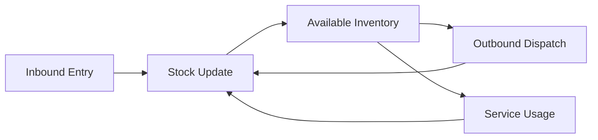

# 🏭 Factory / Warehouse Inventory System

## Milton Roy Dosing Pumps & Spare Parts

---

## 📌 Overview

This project is a centralized inventory management system designed for tracking **Milton Roy dosing pumps, spare parts, and accessories** across factory or warehouse environments.

It enables efficient monitoring of:

* 📥 Inbound materials (pumps & spares)
* 📤 Outbound dispatch (sales / transfers)
* 🔧 Service & maintenance tracking
* 📊 Real-time stock availability

Milton Roy equipment is widely used in industries such as **water treatment, oil & gas, chemicals, and power plants**, requiring accurate inventory control for critical operations.

---

## 🎯 Key Features

### 📥 Inbound Management

* Record incoming pumps and spare parts
* Capture supplier details, GRN (Goods Receipt Note)
* Track batch/serial numbers
* Quality inspection status

### 📤 Outbound Management

* Dispatch pumps and spares
* Sales order / internal transfer tracking
* Customer/vendor details
* Shipment and invoice mapping

### 🔧 Service & Maintenance

* Track pumps under servicing
* Maintain service history logs
* Spare parts consumption tracking
* AMC (Annual Maintenance Contract) tracking

### 📦 Stock Management

* Real-time inventory status
* Minimum stock alerts
* Warehouse/bin location tracking
* Multi-location inventory support

---

## 🗂️ Inventory Categories

### 🔹 Dosing Pumps

* mRoy Series
* Milroyal Series
* Primeroyal Series
* Maxroy Series
* EMAG Series

### 🔹 Spare Parts

* Diaphragms
* Valves (Back pressure, Safety)
* Seals & O-rings
* Pistons / Plungers
* Gear assemblies
* Calibration columns
* Pulsation dampeners

---

## 🧾 Database Structure

### 1. 📥 Inbound Table

| Field              | Description      |
| ------------------ | ---------------- |
| id                 | Unique entry ID  |
| date               | Received date    |
| item_name          | Pump/Spare name  |
| model_no           | Model/Series     |
| quantity           | Received qty     |
| supplier           | Vendor name      |
| serial_no          | Unique serial    |
| warehouse_location | Storage location |

---

### 2. 📤 Outbound Table

| Field             | Description        |
| ----------------- | ------------------ |
| id                | Unique dispatch ID |
| date              | Dispatch date      |
| item_name         | Pump/Spare         |
| model_no          | Model/Series       |
| quantity          | Dispatched qty     |
| customer          | Customer name      |
| invoice_no        | Invoice reference  |
| dispatch_location | Delivery location  |

---

### 3. 🔧 Service Table

| Field        | Description         |
| ------------ | ------------------- |
| id           | Service ID          |
| pump_serial  | Pump serial number  |
| service_date | Service date        |
| issue        | Problem description |
| parts_used   | Spare parts used    |
| technician   | Assigned engineer   |
| status       | Completed / Pending |

---

### 4. 📦 Stock Table

| Field           | Description     |
| --------------- | --------------- |
| item_id         | Unique item ID  |
| item_name       | Pump/Spare      |
| model_no        | Model/Series    |
| opening_stock   | Initial qty     |
| inbound_qty     | Total received  |
| outbound_qty    | Total issued    |
| current_stock   | Available stock |
| min_stock_level | Threshold alert |

---

## ⚙️ System Workflow



---

## 🔐 User Roles

* **Admin**

  * Full access to all modules
* **Store Manager**

  * Inbound, Outbound, Stock control
* **Service Engineer**

  * Service & maintenance updates
* **Viewer**

  * Read-only dashboard access

---

## 📊 Reports & Analytics

* Daily stock report
* Inbound vs outbound trends
* Low stock alerts
* Service history report
* Fast-moving / slow-moving items

---

## 🚀 Technology Stack (Example)

* Frontend: HTML, CSS, JavaScript
* Backend: Node.js / Python / PHP
* Database: SQLite / MySQL / Firebase
* Hosting: Local server / Cloud / GitHub Pages (frontend only)

---

## 📁 File Structure

```
/project
 ├── index.html
 ├── dashboard.html
 ├── js/
 │    └── app.js
 ├── css/
 │    └── style.css
 ├── db/
 │    └── data.db
 └── README.md
```

---

## 📌 Use Cases

* Factory inventory tracking
* Warehouse stock control
* Spare parts lifecycle management
* Industrial service management
* View & Editable only for single signup users with same computer, it does not work in other systems applying same credentials 
---

## ⚠️ Notes

* Ensure serial number tracking for critical pumps
* Maintain safety stock for fast-moving spares
* Regularly audit inventory for accuracy
* Backup database periodically

---

## 📞 Support

For technical or operational queries, refer to official Milton Roy documentation or contact your authorized distributor.

---

## 📄 License

This project is intended for internal industrial use and can be customized as per organizational needs.

---
